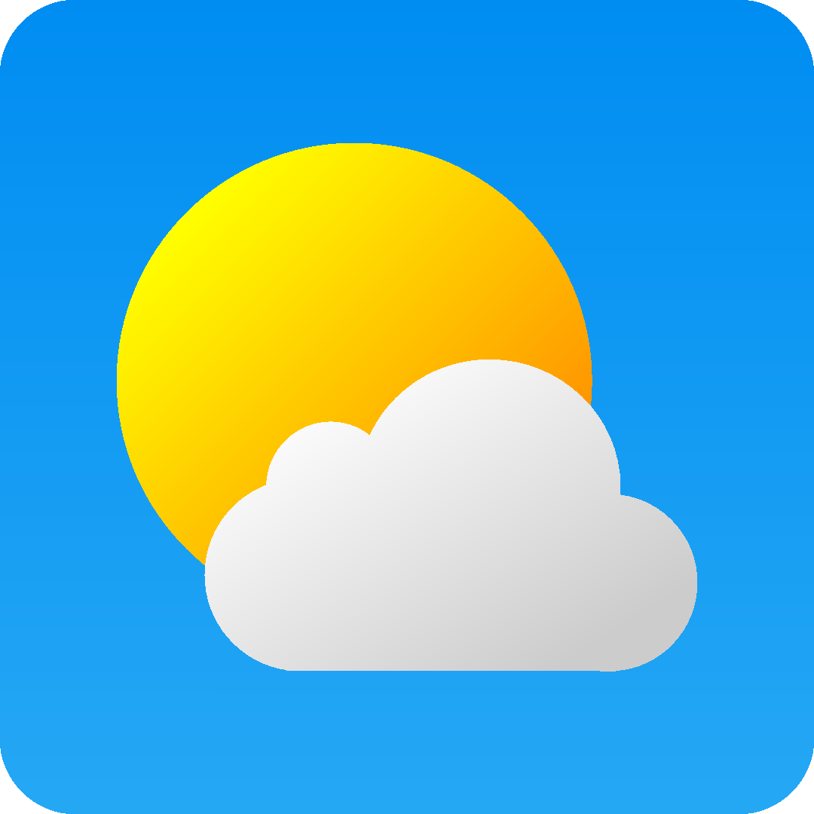
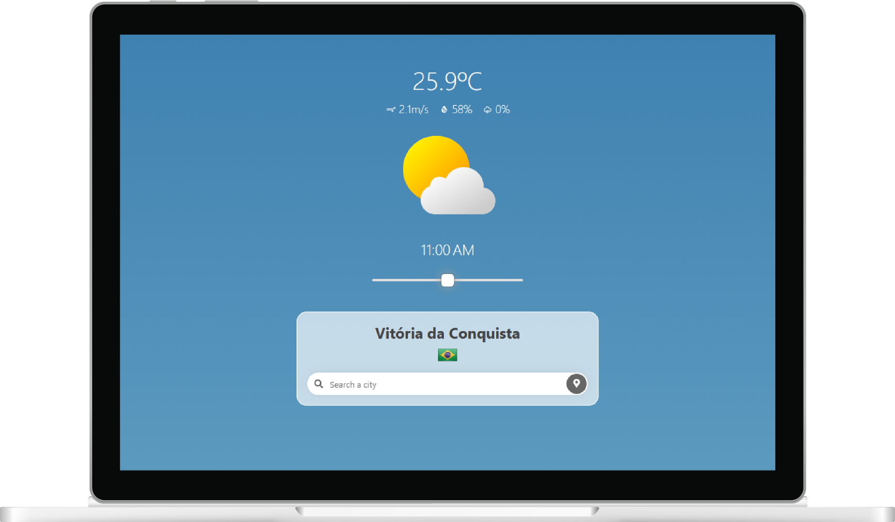
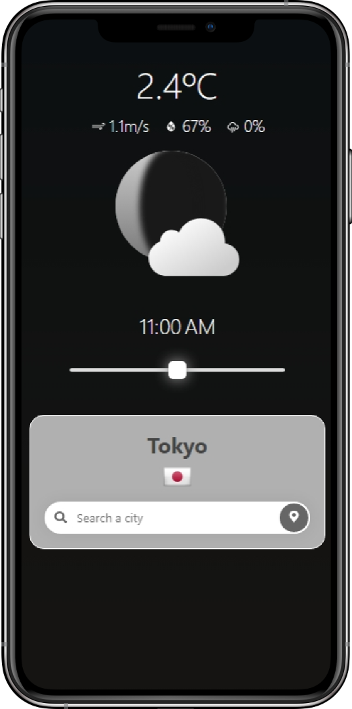

 

    

<h1 align=center>SWeather+</h1>

    <a href='https://sweather-plus.vercel.app/'>sweather-plus.vercel.app</a>
      
    
    &nbsp;
    
    &nbsp;
    
    &nbsp;
    
    &nbsp;
    

&nbsp;

    
    &nbsp;&nbsp;&nbsp;&nbsp;
    

&nbsp;

## 💡 Motivation

> The name "SWeather" comes from "Styled Weather" and represents the idea of creating an alternative way to show the weather forecast, being special to the user experience.
>
> With smooth transitions and animations that vary according to the weather, the app is very intuitive, making it possible to navigate between time intervals from the past to the future.
>
> Try it yourself!

&nbsp;

This project is a remake of the previous [SWeather](https://github.com/gabriel-dp/SWeather), with the same goal, but with many additional features.

The reason to develop a whole app again is simple, learn more and improve my programming skills.

Using TypeScript with React and Express, the new app is better for the user and the developer, with easier maintenance and bug fixing.

&nbsp;

## ✨ Features

- Search weather by name of any city in the world or by user location

- Time slider to see the weather for the day [-6h in the past, +6h in the future]

- Day/Night animations with moonphases

- Precipitation animations (Rain, FreezingRain, Sleets and Snow)

&nbsp;

## ⚙️ APIs

This is a non-commercial and non-profit project, all data used is aimed at learning more about APIs usage and FrontEnd development.

### ⛅ Weather

All weather data comes from **_Tomorrow.io_**, a great Weather API.

> [Access the official website](https://www.tomorrow.io)
>
> [Access the official repository](https://github.com/tomorrow-io-API)

### 📌 Location

The location data is provided by **_OpenWeather_**.

> [Access the official website](https://openweathermap.org/)
